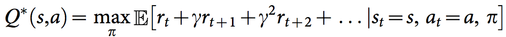

# Deep Reinforcement Learning : Navigation

This project repository contains my work for the Udacity's [Deep Reinforcement Learning Nanodegree](https://www.udacity.com/course/deep-reinforcement-learning-nanodegree--nd893) Project 1: Navigation.

## Project Details

### The goal of this project

In this project, the goal is to train an agent to navigate a in a large, square world and collect as many yellow bananas as possible while avoiding blue bananas.


### Enviroment 

The environment is based on [Unity ML-agents](https://github.com/Unity-Technologies/ml-agents)

Note: The project environment provided by Udacity is similar to, but not identical to the [Banana Collector](https://github.com/Unity-Technologies/ml-agents/blob/master/docs/Learning-Environment-Examples.md#banana-collector) environment on the Unity ML-Agents GitHub page.

> The Unity Machine Learning Agents Toolkit (ML-Agents) is an open-source Unity plugin that enables games and simulations to serve as environments for training intelligent agents. Agents can be trained using reinforcement learning, imitation learning, neuroevolution, or other machine learning methods through a simple-to-use Python API. 

A reward of +1 is provided for collecting a yellow banana, and a reward of -1 is provided for collecting a blue banana. Thus, the goal of your agent is to collect as many yellow bananas as possible while avoiding blue bananas.

The state space has 37 dimensions and contains the agent's velocity, along with ray-based perception of objects around the agent's forward direction. 

Given this information, the agent has to learn how to best select actions. Four discrete actions are available, corresponding to:

- 0 - move forward.
- 1 - move backward.
- 2 - turn left.
- 3 - turn right.

The task is episodic, and **in order to solve the environment, the agent must get an average score of +13 over 100 consecutive episodes.**

The task is episodic, and in order to solve the environment, your agent must get an average score of +13 over 100 consecutive episodes.


#### Solution

The agent will be trained using a Deep Q-Learning algorithm based on this [paper](http://files.davidqiu.com//research/nature14236.pdf) 

#### Theoritical Backround

#### Q-Function
To discover an optimal policy, I setup a Q-function. The Q-function calculates the expected reward `R` for all possible actions `A` in all possible states `S`.


We can then define our optimal policy `π*` as the action that maximizes the Q-function for a given state across all possible states. The optimal Q-function `Q*(s,a)` maximizes the total expected reward for an agent starting in state `s` and choosing action `a`, then following the optimal policy for each subsequent state.


In order to discount returns at future time steps, the Q-function can be expanded to include the hyperparameter gamma `γ`.




#### Epsilon Greedy Algorithm
One challenge with the Q-function above is choosing which action to take while the agent is still learning the optimal policy. Should the agent choose an action based on the Q-values observed thus far? Or, should the agent try a new action in hopes of earning a higher reward? This is known as the **exploration vs. exploitation dilemma**.

To address this, I implemented an **𝛆-greedy algorithm**. This algorithm allows the agent to systematically manage the exploration vs. exploitation trade-off. The agent "explores" by picking a random action with some probability epsilon `𝛜`. However, the agent continues to "exploit" its knowledge of the environment by choosing actions based on the policy with probability (1-𝛜).

Furthermore, the value of epsilon is purposely decayed over time, so that the agent favors exploration during its initial interactions with the environment, but increasingly favors exploitation as it gains more experience. The starting and ending values for epsilon, and the rate at which it decays are three hyperparameters that are later tuned during experimentation.

You can find the 𝛆-greedy logic implemented as part of the `agent.act()` method [here](https://github.com/tommytracey/DeepRL-P1-Navigation/blob/master/agent.py#L66) in `agent.py` of the source code.


#### Deep Q-Network (DQN)
With Deep Q-Learning, a deep neural network is used to approximate the Q-function. Given a network `F`, finding an optimal policy is a matter of finding the best weights `w` such that `F(s,a,w) ≈ Q(s,a)`.

The neural network architecture used for this project can be found [here](https://github.com/tommytracey/DeepRL-P1-Navigation/blob/master/model.py#L5) in the `model.py` file of the source code. The network contains three fully connected layers with 64, 64, and 4 nodes respectively. Testing of bigger networks (more nodes) and deeper networks (more layers) did not produce better results.

As for the network inputs, rather than feeding-in sequential batches of experience tuples, I randomly sample from a history of experiences using an approach called Experience Replay.


#### Experience Replay
Experience replay allows the RL agent to learn from past experience.

Each experience is stored in a replay buffer as the agent interacts with the environment. The replay buffer contains a collection of experience tuples with the state, action, reward, and next state `(s, a, r, s')`. The agent then samples from this buffer as part of the learning step. Experiences are sampled randomly, so that the data is uncorrelated. This prevents action values from oscillating or diverging catastrophically, since a naive Q-learning algorithm could otherwise become biased by correlations between sequential experience tuples.

Also, experience replay improves learning through repetition. By doing multiple passes over the data, our agent has multiple opportunities to learn from a single experience tuple. This is particularly useful for state-action pairs that occur infrequently within the environment.

The implementation of the replay buffer can be found [here](https://github.com/tommytracey/DeepRL-P1-Navigation/blob/master/agent.py#L133) in the `agent.py` file of the source code.


### Getting Started
Please note that the instruction bellow is for Linux enviroment and they have been tested on Ubuntu 18.04 LTS.

1. Prepare a `python 3.6` enviroment.


2. Install required python libraries

	```
	source ./install.sh
	```

4. Install Unity on your system. Detailed instructions [here](https://tsfoss.com/use-unity-ubuntu-17-10/).

5. Download the environment from one of the links below.  You need only select the environment that matches your operating system:
    - Linux: [click here](https://s3-us-west-1.amazonaws.com/udacity-drlnd/P1/Banana/Banana_Linux.zip)
    - Mac OSX: [click here](https://s3-us-west-1.amazonaws.com/udacity-drlnd/P1/Banana/Banana.app.zip)
    - Windows (32-bit): [click here](https://s3-us-west-1.amazonaws.com/udacity-drlnd/P1/Banana/Banana_Windows_x86.zip)
    - Windows (64-bit): [click here](https://s3-us-west-1.amazonaws.com/udacity-drlnd/P1/Banana/Banana_Windows_x86_64.zip)
    

